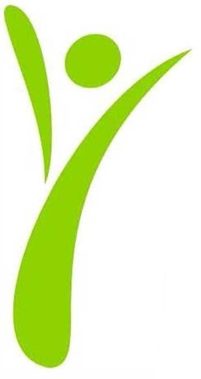
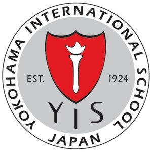

## Summary
Videogame Development student in last year of degree, with excellent development and project management skills, committed to highest quality work and attracted by innovative approaches and technologies. Action-oriented with strong ability to communicate effectively with technology, executive, user, and business audiences.
Versed in C++, C#, Python, GLSL and other programming as well as several gaming engines like Unity. Desires a challenging role as a programmer/developer to further improve.

## Main Skills
* C++
* C#
* Unity
* Python
* JavaScript

## Other Competences
* Scrum
* MySQL
* Data Analisys
* Houdini - Post Production and FXs
* 3D Studio Max - Modeling
* Maya - Rigging, skining and animation
* Photoshop
* Adobe animate - 2D Animation

## Education and training test8

{: .align-left}The rest of this paragraph is filler for the sake of seeing the text wrap around the 150×150 image, which is **left aligned**.

As you can see the should be some space above, below, and to the right of the image. The text should not be creeping on the image. Creeping is just not right. Images need breathing room too. Let them speak like you words. Let them do their jobs without any hassle from the text. In about one more sentence here, we'll see that the text moves from the right of the image down below the image in seamless transition. Again, letting the do it's thing. Mission accomplished!

And now for a **massively large image**. It also has **no alignment**.

<figure style="width: 80px" class="align-left">
  
  <figcaption>test8</figcaption>
</figure> 

Bachelor of Science: Videogame Development and Engineering
Centre de la Imatge i Tecnologia Multimedia | CITM (UPC) - Terrassa 2019
Terrassa

<figure class="third">
	
</figure>
High School Diploma: High School
Escola Pia Nostra Senyora 2014
Barcelona, Barcelona

<figure class="third">
	
</figure>
Middle School
Yokohama International School 2009
Yokohama, Tokyo

## Languages
* English - Proficient
* Spanish - Native
* Catalan - Native

## Activities and honors
* Kiokushinkai Karate
